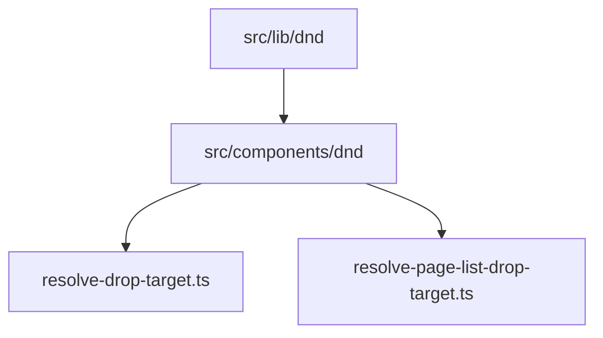

# Drag-and-drop toolkit

Native HTML5 drag-and-drop shared by the **canvas block editor** and the **sidebar page list**. The toolkit owns sensors, transient drag state, rect caching, and drag-image plumbing; each surface keeps its own drop-resolution rules and command dispatch.

## Layers

| Layer | Path | Role |
|-------|------|------|
| Core (pure) | [`src/lib/dnd/`](../../src/lib/dnd/) | MIME channel, rect snapshots, vertical bands, external drag store |
| Headless React | [`src/components/dnd/`](../../src/components/dnd/) | `DndSurface`, prop-getter hooks, optional `DragOverlay` |
| Canvas domain | [`resolve-drop-target.ts`](../../src/lib/canvas/resolve-drop-target.ts) | Block/column/list drop targets → `row.move` / `row.moveToPosition` |
| Sidebar domain | [`resolve-page-list-drop-target.ts`](../../src/lib/pages/resolve-page-list-drop-target.ts) | Page tree bands (sibling vs nest) → `page.reposition` |

## Core utilities

| Module | API | Notes |
|--------|-----|-------|
| [`drag-channel.ts`](../../src/lib/dnd/drag-channel.ts) | `createDragChannel(mimeType)` | Typed `write` / `read` on `dataTransfer`; `effectAllowed = move` |
| [`rects.ts`](../../src/lib/dnd/rects.ts) | `collectRects(attribute)` | Snapshots `[attribute]` elements at drag start; re-measured on scroll/resize (rAF-throttled) |
| [`band.ts`](../../src/lib/dnd/band.ts) | `resolveBand(clientY, rect, opts)` | `before` / `middle` / `after` edge bands (sidebar maps `middle` → nest) |
| [`drag-store.ts`](../../src/lib/dnd/drag-store.ts) | `createDragStore()` | `{ draggingId, pointer, dropTarget }` with `subscribe` / `getSnapshot` for `useSyncExternalStore` |
| [`drag-image.ts`](../../src/lib/dnd/drag-image.ts) | `setEmptyDragImage`, `setClonedDragImage` | Hide native chip or clone row content (syncs `[data-canvas-field]` values) |

## Headless React

### `DndSurface`

[`dnd-surface.tsx`](../../src/components/dnd/dnd-surface.tsx) wraps one drag surface:

- Owns a [`createDragStore`](../../src/lib/dnd/drag-store.ts) instance and exposes context (`beginDrag`, `movePointer`, `commitDrop`, `cancelDrag`).
- On `dragstart`: caches rects via `collectRects(rowAttribute)`, writes the MIME payload, applies `dragImage` (`overlay` → 1×1 canvas; `native-clone` → off-screen DOM clone).
- Tracks pointer on `document` `dragover` with **rAF batching** and calls `resolveDropTarget` only when the pointer moves.
- During a drag, window `scroll` (capture) / `resize` re-measure cached rects via `scheduleRectRefresh` — one `collectRects` pass per animation frame, so drag-scroll doesn't thrash layout.
- `onDrop` receives `{ sourceId, target, pointer }` from the store snapshot or a final resolve pass.

### Hooks ([`use-dnd.ts`](../../src/components/dnd/use-dnd.ts))

| Hook | Use |
|------|-----|
| `useDragSource({ id, holdMs?, onClickWithoutDrag? })` | Spread `getSourceProps()` on the draggable element; composes [`usePointerClickVsDrag`](../../src/hooks/use-pointer-click-vs-drag.ts) and optional hold-to-grab |
| `useDropZone()` | Spread `getDropZoneProps()` on the container (`nav`, canvas wrapper) |
| `useDropTarget(selector)` | `useSyncExternalStore` slice of `dropTarget` — only rows whose selector result changes re-render |
| `useDragState(selector)` | Same for `draggingId` / `pointer` (e.g. disable inputs while dragging) |

### `DragOverlay`

[`drag-overlay.tsx`](../../src/components/dnd/drag-overlay.tsx) portals a follow-pointer preview when `dragImage.kind === "overlay"`. The sidebar uses it with [`PageListDragPreview`](../../src/components/pages/page-list-drag-preview.tsx), which positions via `transform: translate3d(...)` so pointer-follow stays compositor-only (no layout/paint per move).

## Surface wiring

| Surface | Provider | Row attribute | MIME type | Drag image | Drop zone | Domain resolver |
|---------|----------|---------------|-----------|------------|-----------|-----------------|
| Sidebar | [`PageListLive`](../../src/components/pages/page-list.tsx) | `data-page-list-row-id` | `application/x-page-id` | [`setEmptyDragImage`](../../src/lib/dnd/drag-image.ts) (body-attached) + [`DragOverlay`](../../src/components/dnd/drag-overlay.tsx) / [`PageListDragPreview`](../../src/components/pages/page-list-drag-preview.tsx) | `<nav>` via `useDropZone` | [`resolvePageListDropTargetFromPointer`](../../src/lib/pages/resolve-page-list-drop-target.ts) |
| Canvas | [`PageCanvasEditor`](../../src/components/canvas/page-canvas-editor.tsx) | `data-canvas-row-id` | `application/x-canvas-row-id` | `native-clone` of `[data-canvas-row-content]` | `CanvasDropZone` div | [`resolveDropTargetFromPointer`](../../src/lib/canvas/resolve-drop-target.ts) |
| Table layout | [`TableView`](../../src/components/blocks/types/table/table-view.tsx) (`TableColumnDnD` nested) | `data-table-row-id` (rows) / `data-table-column-drag-id` (columns) | row: `application/x-canvas-row-id`; column: `application/x-table-column-index` | row: native clone; column: overlay | `[data-table-layout]` | [`resolveTableLayoutDrop`](../../src/lib/canvas/resolve-table-drop-target.ts) (rows); inline column resolver in `table-view.tsx` |

Drop indicators:

- Sidebar: [`PageListItem`](../../src/components/pages/page-list-item.tsx) uses `useDropTarget` for sibling lines and nest highlight.
- Canvas: [`CanvasRowShell`](../../src/components/canvas/canvas-row-shell.tsx), [`ColumnView`](../../src/components/blocks/types/columns/column-view.tsx), and [`TableView`](../../src/components/blocks/types/table/table-view.tsx) use `useDropTarget` for `--selection` insertion lines (table column drops use vertical lines between header cells).

### Table layout

When the pointer is inside `[data-table-layout]`, [`resolveTableLayoutDrop`](../../src/lib/canvas/resolve-table-drop-target.ts) runs before the generic canvas pass:

- **Row mode** — vertical midpoint bands on `[data-table-row-id]` rects among `tableRow` siblings → standard `row.move`. The header row is skipped when `table.props.hasHeaderRow` (grip hidden on that row).
- **Column mode** — nested `DndSurface` on the table header with MIME `application/x-table-column-index`; horizontal bands on `[data-table-column-drag-id]` header cells → `table.reorderColumn`. Implemented in [`table-view.tsx`](../../src/components/blocks/types/table/table-view.tsx) (not the top-level canvas resolver).

Full grid model and keyboard map: [table-blocks](./table-blocks.md).

Grip source: [`BlockGutter`](../../src/components/canvas/block-gutter.tsx) calls `useDragSource` on the grab button (no separate `row-drag` / `drag-ghost` modules).

## Performance

Previously, every row re-rendered on each `dragover` because `dropTarget` lived in React context or parent state. The external store plus `useDropTarget` / `useDragState` selectors compare the selected slice with `Object.is` and bail out when unchanged, so only rows affected by the current target (and the overlay) update per pointer move.

## Out of scope

- Column resize and sidebar rail resize (pointer gestures, not HTML5 DnD).
- Keyboard-accessible reorder (would need a separate sensor).
- Third-party DnD libraries.

## Related

- [Canvas editor — Drag and drop](./canvas-editor.md#drag-and-drop)
- [Pages — Sidebar drag-and-drop](./pages.md#sidebar-drag-and-drop)
- [Canvas commands](../reference/canvas-commands.md)
- [Page commands — `page.reposition`](../reference/page-commands.md#page-reposition)
