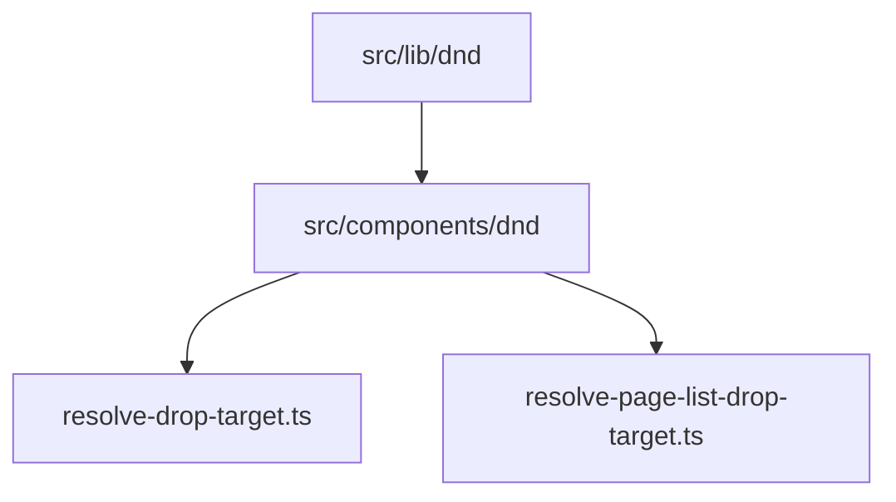

# Drag-and-drop toolkit

Native HTML5 drag-and-drop shared by the **canvas block editor** and the **sidebar page list**. The toolkit owns sensors, transient drag state, rect caching, and drag-image plumbing; each surface keeps its own drop-resolution rules and command dispatch.

## Layers

| Layer | Path | Role |
|-------|------|------|
| Core (pure) | [`src/lib/dnd/`](../../src/lib/dnd/) | MIME channel, rect snapshots, vertical bands, external drag store |
| Headless React | [`src/components/dnd/`](../../src/components/dnd/) | `DndSurface`, prop-getter hooks, optional `DragOverlay` |
| Canvas domain | [`resolve-drop-target.ts`](../../src/lib/canvas/resolve-drop-target.ts) | Block/column/list drop targets → `row.move` / `row.moveToPosition` |
| Sidebar domain | [`resolve-page-list-drop-target.ts`](../../src/lib/pages/resolve-page-list-drop-target.ts) | Page tree bands (sibling vs nest) → `page.reposition` |

## Core utilities

| Module | API | Notes |
|--------|-----|-------|
| [`drag-channel.ts`](../../src/lib/dnd/drag-channel.ts) | `createDragChannel(mimeType)` | Typed `write` / `read` on `dataTransfer`; `effectAllowed = move` |
| [`rects.ts`](../../src/lib/dnd/rects.ts) | `collectRects(attribute)` | Snapshots `[attribute]` elements at drag start; re-measured on scroll/resize (rAF-throttled) |
| [`band.ts`](../../src/lib/dnd/band.ts) | `resolveBand(clientY, rect, opts)` | `before` / `middle` / `after` edge bands (sidebar maps `middle` → nest) |
| [`drag-store.ts`](../../src/lib/dnd/drag-store.ts) | `createDragStore()` | `{ draggingId, pointer, dropTarget }` with `subscribe` / `getSnapshot` for `useSyncExternalStore` |
| [`drag-image.ts`](../../src/lib/dnd/drag-image.ts) | `setEmptyDragImage`, `setClonedDragImage` | Hide native chip or clone row content (syncs `[data-canvas-field]` values) |

## Headless React

### `DndSurface`

[`dnd-surface.tsx`](../../src/components/dnd/dnd-surface.tsx) wraps one drag surface:

- Owns a [`createDragStore`](../../src/lib/dnd/drag-store.ts) instance and exposes context (`beginDrag`, `movePointer`, `commitDrop`, `cancelDrag`).
- On `dragstart`: caches rects via `collectRects(rowAttribute)`, writes the MIME payload, applies `dragImage` (`overlay` → 1×1 canvas; `native-clone` → off-screen DOM clone).
- Tracks pointer on `document` `dragover` with **rAF batching** and calls `resolveDropTarget` only when the pointer moves.
- During a drag, window `scroll` (capture) / `resize` re-measure cached rects via `scheduleRectRefresh` — one `collectRects` pass per animation frame, so drag-scroll doesn't thrash layout.
- `onDrop` receives `{ sourceId, target, pointer }` from the store snapshot or a final resolve pass.

### Hooks ([`use-dnd.ts`](../../src/components/dnd/use-dnd.ts))

| Hook | Use |
|------|-----|
| `useDragSource({ id, holdMs?, onClickWithoutDrag?, useCanvasRowSurface? })` | Spread `getSourceProps()` on the draggable element; composes [`usePointerClickVsDrag`](../../src/hooks/use-pointer-click-vs-drag.ts) and optional hold-to-grab. On coarse pointers it swaps the native path for a pointer-event drag (see [Touch drags](#touch-pointer-drags)). `useCanvasRowSurface` binds to the parent canvas row [`DndContext`](../../src/components/dnd/dnd-surface.tsx) via [`CanvasRowDndBridge`](../../src/components/dnd/canvas-row-dnd-bridge.tsx) when nested inside another surface (table column DnD). |
| `useDropZone()` | Spread `getDropZoneProps()` on the container (`nav`, canvas wrapper) |
| `useDropTarget(selector)` | `useSyncExternalStore` slice of `dropTarget` — only rows whose selector result changes re-render |
| `useDragState(selector)` | Same for `draggingId` / `pointer` (e.g. disable inputs while dragging) |

### `DragOverlay`

[`drag-overlay.tsx`](../../src/components/dnd/drag-overlay.tsx) portals a follow-pointer preview when `dragImage.kind === "overlay"`. The sidebar uses it with [`PageListDragPreview`](../../src/components/pages/page-list-drag-preview.tsx), which positions via `transform: translate3d(...)` so pointer-follow stays compositor-only (no layout/paint per move).

### Nested surfaces — `CanvasRowDndBridge`

[`PageCanvasEditor`](../../src/components/canvas/page-canvas-editor.tsx) wraps the canvas in an outer [`DndSurface`](../../src/components/dnd/dnd-surface.tsx) (canvas row channel) and a [`CanvasRowDndBridge`](../../src/components/dnd/canvas-row-dnd-bridge.tsx) that re-exposes that context to descendants. Nested table column [`DndSurface`](../../src/components/dnd/dnd-surface.tsx) instances shadow the nearest `DndContext`; table row structure handles set `useCanvasRowSurface: true` on `useDragSource` so row drags still write `application/x-canvas-row-id` and commit through the canvas resolver.

The DnD surface is part of the editor chunk only. The pre-editor read-only render views ([`page-canvas-server.tsx`](../../src/components/canvas/page-canvas-server.tsx) / [`page-canvas-local-view.tsx`](../../src/components/canvas/page-canvas-local-view.tsx)) render blocks without any `DndSurface`, so reorder DnD activates once `PageCanvasEditor` swaps in — see [canvas-editor — Render pipeline](./canvas-editor.md#render-pipeline-flash-free).

### Touch (pointer) drags

Native HTML5 DnD never starts on touch, so on coarse primary pointers (`(pointer: coarse)` via [`useIsCoarsePrimaryPointer`](../../src/hooks/device-layout.ts)) [`useDragSource`](../../src/components/dnd/use-dnd.ts) drives the drag from pointer events instead:

- The grip drops its `draggable` attribute and gets `touch-action: none`. A press that travels past `TOUCH_DRAG_THRESHOLD_PX` captures the pointer, marks the click suppressed (so the trailing `click` can't open the [`BlockActionsMenu`](../../src/components/canvas/block-actions-menu.tsx)), and calls `ctx.beginPointerDrag`. A press that releases without moving is a tap and opens the menu via the native click. `store.startDrag(..., pointerDrag: true)` flags the drag so previews can distinguish it.
- On coarse pointers the canvas **gutter is hidden**; block actions open from a long-press on row content into [`MobileBlockActionsDrawer`](../../src/components/canvas/mobile-block-actions-drawer.tsx) instead (see [canvas-editor — Block selection](./canvas-editor.md#block-selection)).
- [`DndSurface.beginPointerDrag`](../../src/components/dnd/dnd-surface.tsx) starts the store, resolves the first target, and runs an rAF **edge auto-scroll** loop against the nearest scrollable ancestor (the native `dragover` path gets browser auto-scroll for free). `movePointer` feeds subsequent positions; `commitPointerDrop` applies `onDrop` from the store snapshot.
- Because the finger grabs the left gutter (outside the row content rects), the canvas `resolveDropTarget` nudges the pointer X into the content column for pointer drags only (`pointerDragActiveRef` in [`PageCanvasEditor`](../../src/components/canvas/page-canvas-editor.tsx)); native (mouse) drags keep their true X.
- The drag image is a React overlay, not a native chip: [`CanvasRowDragPreview`](../../src/components/dnd/canvas-row-drag-preview.tsx) renders a clone of `[data-canvas-row-content]` (live field values copied via [`cloneNodeWithFieldValues`](../../src/lib/dnd/drag-image.ts)) so the dragged block reads as itself, not the browser's translucent box. Sidebar/table touch drags reuse their existing overlays.

## Surface wiring

| Surface | Provider | Row attribute | MIME type | Drag image | Drop zone | Domain resolver |
|---------|----------|---------------|-----------|------------|-----------|-----------------|
| Sidebar | [`PageListLive`](../../src/components/pages/page-list.tsx) | `data-page-list-row-id` | `application/x-page-id` | [`setEmptyDragImage`](../../src/lib/dnd/drag-image.ts) (body-attached) + [`DragOverlay`](../../src/components/dnd/drag-overlay.tsx) / [`PageListDragPreview`](../../src/components/pages/page-list-drag-preview.tsx) | `<nav>` via `useDropZone` | [`resolvePageListDropTargetFromPointer`](../../src/lib/pages/resolve-page-list-drop-target.ts) |
| Canvas | [`PageCanvasEditor`](../../src/components/canvas/page-canvas-editor.tsx) | `data-canvas-row-id` | `application/x-canvas-row-id` | `native-clone` of `[data-canvas-row-content]` | `CanvasDropZone` div | [`resolveDropTargetFromPointer`](../../src/lib/canvas/resolve-drop-target.ts) |
| Table layout | [`TableView`](../../src/components/blocks/types/table/table-view.tsx) (`TableColumnDnD` nested; row handles via `CanvasRowDndBridge`) | `data-table-row-id` (rows) / `data-table-column-drag-id` (columns) | row: `application/x-canvas-row-id` (`useCanvasRowSurface`); column: `application/x-table-column-index` | row: [`DragOverlay`](../../src/components/dnd/drag-overlay.tsx) / [`TableRowDragPreview`](../../src/components/blocks/types/table/table-row-drag-preview.tsx) on [`PageCanvasEditor`](../../src/components/canvas/page-canvas-editor.tsx); column: [`DragOverlay`](../../src/components/dnd/drag-overlay.tsx) / [`TableColumnDragPreview`](../../src/components/blocks/types/table/table-column-drag-preview.tsx) | `[data-table-layout]` (column zone inside `TableColumnDnD`) | [`resolveTableLayoutDrop`](../../src/lib/canvas/resolve-table-drop-target.ts) (rows); `resolveTableColumnDropTarget` in `table-view.tsx` (columns) |

Drop indicators:

- Sidebar: [`PageListItem`](../../src/components/pages/page-list-item.tsx) uses `useDropTarget` for sibling lines and nest highlight.
- Canvas: [`CanvasRowShell`](../../src/components/canvas/canvas-row-shell.tsx), [`ColumnView`](../../src/components/blocks/types/columns/column-view.tsx), and [`TableView`](../../src/components/blocks/types/table/table-view.tsx) use `useDropTarget` / `useCanvasRowDropTarget` for insertion lines (`bg-selection-primary` horizontal/vertical lines).

### Table layout

When the pointer is inside `[data-table-layout]`, [`resolveTableLayoutDrop`](../../src/lib/canvas/resolve-table-drop-target.ts) runs before the generic canvas pass:

- **Row mode** — [`TableRowHandle`](../../src/components/blocks/types/table/table-row-handle.tsx) spreads `useDragSource({ useCanvasRowSurface: true })` so drags use the bridged canvas row surface. Vertical midpoint bands on `[data-table-row-id]` rects among `tableRow` siblings → standard `row.move`. The header row is skipped when `table.props.hasHeaderRow`.
- **Column mode** — nested `TableColumnDnD` / `DndSurface` with MIME `application/x-table-column-index`; horizontal midpoint bands on `[data-table-column-drag-id]` header cells (or first body row when no header) → `table.reorderColumn`. Implemented in [`table-view.tsx`](../../src/components/blocks/types/table/table-view.tsx) (not the top-level canvas resolver).

Full grid model, structure handles, and keyboard map: [table-blocks](./table-blocks.md).

Grip sources: [`BlockGutter`](../../src/components/canvas/block-gutter.tsx) (canvas rows on fine pointers — same grab button composes [`BlockActionsMenu`](../../src/components/canvas/block-actions-menu.tsx) for tap/click-to-open and `useDragSource` for drag reorder) and [`TableStructureHandle`](../../src/components/blocks/types/table/table-structure-handle.tsx) (table row/column handles) call `useDragSource` on their grab buttons.

## Drop bands & zones

- **Sidebar** — each row splits into a small top/bottom **sibling** edge (`PAGE_LIST_SIBLING_EDGE_PX`) and a wide central **nest** band (`resolveBand` `middle` → nest). The edge is kept small (6px) so dropping onto a page's body reliably nests it rather than reordering; the between-row gaps reuse the same value for "insert between siblings".
- **Canvas** — the [`CanvasDropZone`](../../src/components/canvas/page-canvas-editor.tsx) fills the scroll area (`flex-1`) so the empty space below the last block still receives native `dragover`/`drop`; a pointer past the last row resolves to `after` the last top-level row.
- **Sidebar → canvas (cross-surface)** — the surfaces are MIME-isolated, but the canvas drop zone additionally sniffs the sidebar's `PAGE_DRAG_MIME_TYPE` (`application/x-page-id`) on `dragover`/`drop`. Dropping a sidebar page onto a canvas inserts a child `pageLink` at the drop position ([`resolveTopLevelInsertEdge`](../../src/lib/canvas/resolve-drop-target.ts) → `row.insert` with `pageId`) and re-nests the page under the open page ([`usePageReposition`](../../src/hooks/use-page-reposition.ts), `appendPageLinkOnParent:false` since the link is placed here), guarded by [`canDropPageIntoCanvas`](../../src/lib/pages/page-canvas-drop.ts) (self / cycle / depth via `assertCanReposition`).

External image/video **files** are not a drop path — the canvas drop zone only resolves row/page MIME channels. Inserting media from outside the app is handled on **paste** instead ([`handleCanvasPasteEvent`](../../src/lib/canvas/canvas-keyboard-shortcuts.ts) → `media` blocks; see [canvas-commands.md](../reference/canvas-commands.md)).

## Performance

Previously, every row re-rendered on each `dragover` because `dropTarget` lived in React context or parent state. The external store plus `useDropTarget` / `useDragState` selectors compare the selected slice with `Object.is` and bail out when unchanged, so only rows affected by the current target (and the overlay) update per pointer move.

## Out of scope

- Column resize and sidebar rail resize (pointer gestures, not HTML5 DnD).
- Keyboard-accessible reorder (would need a separate sensor).
- Third-party DnD libraries.

## Related

- [Canvas editor — Drag and drop](./canvas-editor.md#drag-and-drop)
- [Pages — Sidebar drag-and-drop](./pages.md#sidebar-drag-and-drop)
- [Canvas commands](../reference/canvas-commands.md)
- [Page commands — `page.reposition`](../reference/page-commands.md#page-reposition)

## Scope

This document covers the shared DnD toolkit only. Other modules under `src/components/pages/` (for example the icon picker) are documented in [pages](./pages.md) and do not use this DnD layer.
